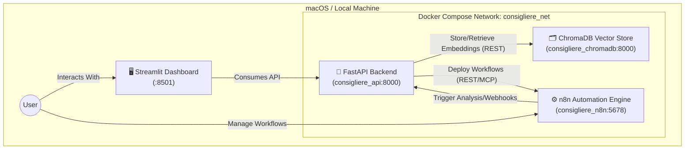

# Project Consigliere 🤖

**Project Consigliere** is a personalized LLM-based assistant platform designed to manage your knowledge, finances, real estate monitoring, and daily automated actions through natural language processing and scheduled workflows.

**Project Consigliere**는 사용자의 다방면(부동산, 금융 등)에 걸친 기억, 지식, 행동을 관리해 주는 개인화된 LLM 기반 비서 플랫폼입니다. 단순 챗봇을 넘어 적극적으로 정보를 수집하고 사용자에게 보고하는 자동화 비서를 지향합니다.

---

## 1. System Overview (시스템 개요)

### ❓ WHAT: What is Consigliere?
Consigliere is your personal AI operations center. It combines a user-friendly **Streamlit Dashboard**, a **FastAPI backend** powered by Gemini LLMs, an **n8n Automation Engine** for scheduling integrations, and a **ChromaDB Vector Store** to act as its long-term memory. 

Consigliere는 개인의 AI 오퍼레이션 센터입니다. 사용하기 쉬운 **Streamlit 대시보드**, Gemini LLM으로 구동되는 **FastAPI 백엔드**, 자동화 및 스케줄링을 위한 **n8n 엔진**, 그리고 장기 기억 장치로 쓰이는 **ChromaDB**를 하나의 유기체처럼 통합한 시스템입니다.

### 🎯 WHY: Why was this built?
To allow users to build and run complex, repeating background tasks (like scraping real-estate transactions every morning, or classifying credit card spending) using simple natural language, without writing ad-hoc scripts every time.

사용자가 복잡한 코딩이나 인프라 설정 없이, "매일 아침 8시에 관심 지역 부동산 실거래가 알려줘"와 같은 자연어 명령만으로 지식 수집과 스케줄링 등의 백그라운드 작업을 손쉽게 자동화하기 위해 만들어졌습니다.

### ⚙️ HOW: How does it work?
When a user sets an objective, the core FastAPI server utilizes the LLM to understand the intent. It can answer immediately, query the local ChromaDB for historical context, or dynamically deploy a JSON workflow template into the containerized n8n engine via the Model Context Protocol (MCP) to run tasks asynchronously in the background.

사용자가 대시보드나 메시지로 목표를 설정하면, FastAPI 코어 서버가 LLM을 활용해 의도를 파악합니다. 즉각적인 대답이 필요하면 ChromaDB 컨텍스트를 활용해 답변하고, 주기적인 작업이 필요하다면 백엔드에서 n8n 워크플로우(JSON)를 동적으로 생성/배포하여 백그라운드에서 스케줄에 맞춰 동작하게 합니다.

---

## 2. Architecture & Container Configuration (컨테이너 구성)

The system relies on a Microservices architecture orchestrated by Docker Compose. The localized environment ensures privacy and avoids high cloud execution costs.

시스템은 Docker Compose로 오케스트레이션되는 마이크로서비스 아키텍처를 따릅니다. 이를 통해 개인정보를 로컬로 보호하고 실행 비용을 낮춥니다.

### Component Details (컨테이너 역할)
1. **`consigliere_api` (FastAPI / Python 3.12)**
   - **Role:** The brain of the operation. It houses the LLM orchestration (`google-genai`), API endpoints for the dashboard, and MCP capabilities to communicate with n8n.
   - **역할:** 시스템의 두뇌. LLM 에이전트 논리를 품고 있으며, 대시보드에서 들어오는 요청을 처리하고, n8n 워크플로우를 주입/관리합니다.

2. **`consigliere_n8n` (n8n)**
   - **Role:** The heartbeat of the automation. Runs scheduled nodes (Cron jobs), HTTP requests, and triggers without locking up the Python thread.
   - **역할:** 자동화의 심장. Python 스레드를 점유하지 않고, 정해진 스케줄이나 이벤트에 따라 트리거되어 외부 API나 데이터를 긁어옵니다.

3. **`consigliere_chromadb` (ChromaDB)**
   - **Role:** The memory manager. Stores vector embeddings of crawled data (e.g., Real Estate transactions) for RAG (Retrieval-Augmented Generation) based context answering.
   - **역할:** 기억 장치 매니저. 크롤링된 데이터나 문서들을 임베딩 및 벡터 형태로 저장하여, 나중에 LLM이 컨텍스트를 기반(RAG)으로 정확한 답을 내놓게 도와줍니다.

---

## 3. Dashboard Menu Guide (메뉴 설명)

The **Streamlit Dashboard** is the primary UI for interacting with the system. You can start it locally via `streamlit run src/dashboard/main.py`.

사용자의 메인 진입점인 **Streamlit 대시보드**의 메뉴 구성은 다음과 같습니다.

### 🏠 Home
- **EN:** The main landing page providing a highly summarized status of your active modules (e.g., Finance, Real Estate).
- **KR:** 메인 대시보드. 금융 지출 요약이나 부동산 모니터링 알림 등 각 모듈의 핵심 상태를 한눈에 볼 수 있는 요약 페이지입니다.

### 💰 Finance
- **EN:** A personal finance ledger manager. Allows you to select specific months, view structured LLM-analyzed transaction grids, and manually modify rows.
- **KR:** 개인 가계부 관리 메뉴. 특정 연월별 지출 내역을 그리드(Grid) 뷰로 조회하고, 항목별 통계를 확인하거나 내역을 수정할 수 있습니다.

### 🏢 Real Estate
- **EN:** Split into two tabs: 
    - **Market Monitor**: Fetches and displays property transaction data via the MOLIT public API. 
    - **News Insights**: Displays LLM-generated daily news summaries analyzing real-estate market sentiments.
- **KR:** 2개의 탭으로 나뉩니다:
    - **마켓 모니터**: 국토부 API를 통해 수집된 특정 지역의 최신 실거래가 데이터를 표 형태로 조회합니다.
    - **뉴스 인사이트**: 네이버 뉴스 API 등을 활용해 매일 주요 부동산 기사를 스크랩하고, LLM이 분석한 인사이트 리포트를 볼 수 있습니다.

### ⚙️ Automation
- **EN:** The command center for n8n integrations. Lists all deployed automation workflows (Status, ID). Includes direct links to jump into the native n8n visual editor to test and tweak logic.
- **KR:** n8n 자동화 워크플로우 관리 메뉴. 현재 백그라운드에서 동작 중이거나 연결된 전체 워크플로우 리스트, 상태 등을 보여줍니다. 워크플로우를 수동 테스트하거나 수정하려면 제공된 `Open in n8n Editor` 버튼을 통해 비주얼 기반의 에디터로 즉시 진입할 수 있습니다.
