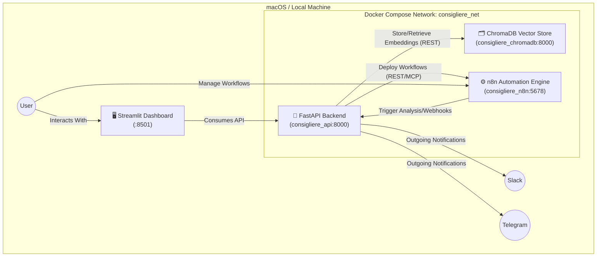

# Project Consigliere 🤖

**Project Consigliere** is a personalized LLM-based assistant platform designed to manage your knowledge, finances, real estate monitoring, career intelligence, and daily automated actions through natural language processing and scheduled workflows.

**Project Consigliere**는 사용자의 다방면(부동산, 금융, 커리어 등)에 걸친 기억, 지식, 행동을 관리해 주는 개인화된 LLM 기반 비서 플랫폼입니다. 단순 챗봇을 넘어 적극적으로 정보를 수집하고 사용자에게 보고하는 자동화 비서를 지향합니다.

---

## 1. System Overview (시스템 개요)

### ❓ WHAT: What is Consigliere?
Consigliere is your personal AI operations center. It combines a user-friendly **Streamlit Dashboard**, a **FastAPI backend** powered by Claude LLMs, an **n8n Automation Engine** for scheduling, and a **ChromaDB Vector Store** for long-term memory. It features **Slack/Telegram integration** for proactive notifications and a **Career Intelligence** module for daily developer trend & job market reports.

Consigliere는 개인의 AI 오퍼레이션 센터입니다. **Streamlit 대시보드**, Claude LLM 기반의 **FastAPI 백엔드**, 자동화 및 스케줄링을 위한 **n8n 엔진**, 장기 기억 장치로 쓰이는 **ChromaDB**를 통합한 시스템입니다. **Slack/Telegram 알림** 및 매일 개발자 트렌드·채용 시장을 분석하는 **커리어 인텔리전스** 기능을 갖추고 있습니다.

### 🎯 WHY: Why was this built?
To allow users to build and run complex, repeating background tasks (like scraping real-estate transactions every morning, or receiving a daily developer career digest) using simple natural language, without writing ad-hoc scripts every time.

사용자가 복잡한 코딩이나 인프라 설정 없이, "매일 아침 8시에 관심 지역 부동산 실거래가 알려줘"와 같은 자연어 명령만으로 지식 수집과 스케줄링 등의 백그라운드 작업을 손쉽게 자동화하기 위해 만들어졌습니다.

### ⚙️ HOW: How does it work?
When a user sets an objective, the core FastAPI server utilizes the LLM to understand the intent. It can answer immediately, query the local ChromaDB for historical context, or dynamically deploy a JSON workflow template into the containerized n8n engine via the Model Context Protocol (MCP) to run tasks asynchronously in the background.

사용자가 대시보드나 메시지로 목표를 설정하면, FastAPI 코어 서버가 LLM을 활용해 의도를 파악합니다. 즉각적인 대답이 필요하면 ChromaDB 컨텍스트를 활용해 답변하고, 주기적인 작업이 필요하다면 백엔드에서 n8n 워크플로우(JSON)를 동적으로 생성/배포하여 백그라운드에서 스케줄에 맞춰 동작하게 합니다.

---

## 2. Architecture & Container Configuration (컨테이너 구성)

The system relies on a Microservices architecture orchestrated by Docker Compose. The localized environment ensures privacy and avoids high cloud execution costs.

시스템은 Docker Compose로 오케스트레이션되는 마이크로서비스 아키텍처를 따릅니다. 이를 통해 개인정보를 로컬로 보호하고 실행 비용을 낮춥니다.

```mermaid
graph TD
    User((User))

    subgraph Host["macOS / Local Machine"]
        StreamlitApp["🖥️ Streamlit Dashboard\n(:8501)"]

        subgraph Docker["Docker Compose Network: consigliere_net"]
            API["🧠 FastAPI Backend\n(consigliere_api:8000)"]
            N8N["⚙️ n8n Automation Engine\n(consigliere_n8n:5678)"]
            Chroma["🗂️ ChromaDB Vector Store\n(consigliere_chromadb:8000)"]

            API -- "Store/Retrieve Embeddings (REST)" --> Chroma
            N8N -- "Trigger Analysis/Webhooks" --> API
            API -- "Deploy Workflows (REST/MCP)" --> N8N
        end

        User -- "Interacts With" --> StreamlitApp
        User -- "Manage Workflows" --> N8N
        StreamlitApp -- "Consumes API" --> API
        API -- "Outgoing Notifications" --> Slack((Slack))
        API -- "Outgoing Notifications" --> Telegram((Telegram))
    end
```

### Component Details (컨테이너 역할)
1. **`consigliere_api` (FastAPI / Python 3.12)**
   - **Role:** The brain of the operation. Houses LLM orchestration (`Claude claude-sonnet-4-6`), API endpoints for the dashboard, and MCP capabilities to communicate with n8n.
   - **역할:** 시스템의 두뇌. LLM 에이전트 논리를 품고 있으며, 대시보드에서 들어오는 요청을 처리하고, n8n 워크플로우를 주입/관리합니다.

2. **`consigliere_n8n` (n8n v2.9.4)**
   - **Role:** The heartbeat of the automation. Runs scheduled nodes (Cron jobs), HTTP requests, and triggers without locking up the Python thread.
   - **역할:** 자동화의 심장. Python 스레드를 점유하지 않고, 정해진 스케줄이나 이벤트에 따라 트리거되어 외부 API나 데이터를 긁어옵니다.

3. **`consigliere_chromadb` (ChromaDB)**
   - **Role:** The memory manager. Stores vector embeddings of crawled data for RAG (Retrieval-Augmented Generation) based context answering.
   - **역할:** 기억 장치 매니저. 크롤링된 데이터나 문서들을 임베딩 및 벡터 형태로 저장하여, LLM이 컨텍스트를 기반(RAG)으로 정확한 답을 내놓게 도와줍니다.

---

## 3. Active Modules (활성 모듈)

### 🏢 Real Estate (부동산)
| 기능 | 설명 |
|------|------|
| 실거래가 수집 | 국토부 API, 수도권 71개 지구, 비동기 aiohttp 병렬 수집 |
| 뉴스 분석 | 네이버 뉴스 + LLM 인사이트 요약 |
| 인사이트 리포트 | 실거래가 + 뉴스 + 거시경제 통합 분석, 페르소나 기반 액션 플랜 |
| 자동 전송 | n8n 스케줄 → Slack 일일 리포트 (07:00 KST) |

### 📊 Career Intelligence (커리어) ← 2026-03-28 추가
| 기능 | 설명 |
|------|------|
| 채용 공고 수집 | Wanted + Jumpit API 자동 수집 (백엔드 포지션) |
| 기술 트렌드 수집 | GitHub Trending + Hacker News + Dev.to |
| 커뮤니티 트렌드 수집 | Reddit (7개 subreddit) + Mastodon (해시태그 타임라인) + 클리앙 + DCInside |
| 스킬갭 분석 | 채용 요구 스킬 vs 현재 스킬 LLM 분석, 학습 추천 |
| 커뮤니티 분석 | 개발자 커뮤니티 여론·핫 토픽·우려사항 LLM 추출 |
| Daily Report | 채용 동향 + 기술 트렌드 + 스킬갭 + 커뮤니티 트렌드 통합 마크다운 리포트 |
| Weekly/Monthly | 주간·월간 누적 분석 리포트 |

### 💰 Finance (금융)
| 기능 | 설명 |
|------|------|
| 가계부 | 마크다운 기반 지출 관리, LLM 분류 |

### ⚙️ Automation (자동화)
| 기능 | 설명 |
|------|------|
| n8n 워크플로우 관리 | FastAPI → n8n API 배포/조회 |
| 스케줄링 | 부동산 리포트 07:00 KST, 커리어 리포트 (설정 가능) |

---

## 4. API Endpoints (주요 엔드포인트)

### Career
| Method | Endpoint | 설명 |
|--------|----------|------|
| `POST` | `/jobs/career/fetch-jobs` | 채용 공고 수집 (캐시 지원) |
| `POST` | `/jobs/career/fetch-trends` | 기술 트렌드 수집 |
| `POST` | `/jobs/career/fetch-community` | 커뮤니티 트렌드 수집 |
| `POST` | `/jobs/career/generate-report` | 일별 통합 리포트 생성 |
| `GET`  | `/jobs/career/reports/daily` | 리포트 목록 조회 |
| `GET`  | `/jobs/career/reports/daily/{date}` | 특정 날짜 리포트 조회 |

### Real Estate
| Method | Endpoint | 설명 |
|--------|----------|------|
| `POST` | `/jobs/real-estate/fetch-transactions` | 실거래가 수집 |
| `POST` | `/jobs/real-estate/fetch-news` | 뉴스 수집 |
| `POST` | `/jobs/real-estate/generate-report` | 인사이트 리포트 생성 |
| `POST` | `/jobs/real-estate/run-pipeline` | 전체 파이프라인 실행 |

---

## 5. Dashboard Menu Guide (대시보드 메뉴)

The **Streamlit Dashboard** is the primary UI for interacting with the system, accessible at [http://localhost:8501](http://localhost:8501).

### 🏠 Home
- 메인 대시보드. 활성 모듈 상태 요약.

### 💰 Finance
- 개인 가계부 관리. 연월별 지출 내역 그리드 조회, LLM 분석 통계.

### 🏢 Real Estate
- **마켓 모니터**: 수도권 71개 지구 실거래가 데이터 조회, 아파트명 검색, 금액 범위 필터.
- **뉴스 인사이트**: 부동산 뉴스 LLM 분석 리포트.
- **리포트 아카이브**: 과거 인사이트 리포트 목록 및 상세 열람.

### ⚙️ Automation
- n8n 워크플로우 목록 및 상태 조회. `Open in n8n Editor` 버튼으로 비주얼 에디터 즉시 진입.
- Telegram을 통한 양방향 통신 지원.
- Claude desktop 도입을 통한 자동화
- 카카오톡 대화방 대화 자동 export 기능
---

## 6. Tech Stack

| Category | Tech |
|----------|------|
| Backend | Python 3.12, FastAPI, aiohttp |
| LLM | Claude claude-sonnet-4-6 (Anthropic) |
| Automation | n8n v2.9.4 |
| Vector DB | ChromaDB |
| Dashboard | Streamlit |
| Notification | Slack Bot API, Telegram Bot API |
| Data | Pydantic v2, BeautifulSoup4 |
| Infra | Docker Compose, Cloudflare Tunnel |
| Testing | pytest, asyncio, MagicMock (101 tests) |
