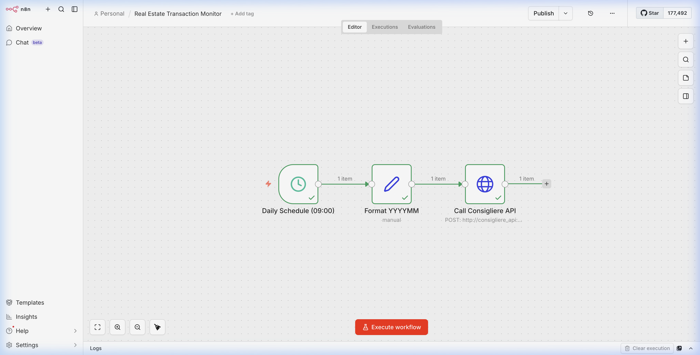
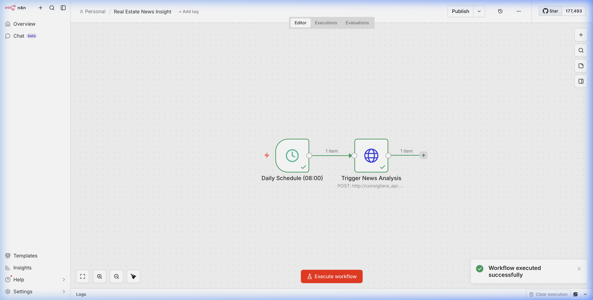

# Feature Result: Workflow Verification & Notification Layer

## Summary
The existing Real Estate workflows (Transaction Monitor & News Insight) have been verified to work correctly on n8n v2. Additionally, a multi-channel notification layer (Gmail & SMS) has been successfully integrated into these workflows.

## Key Changes
- **Verification**: Manually executed and confirmed `WR-003` (Transaction Monitor) and `WR-004` (News Insight) in n8n v2.
- **Gmail Notification**: Added `n8n-nodes-base.emailSend` nodes to provide structured email reports.
- **SMS Notification**: Added HTTP Request nodes to trigger SMS alerts via the Consigliere API.
- **Deployment**: Updated local JSON workflow files and synchronized them with the live n8n container.

## Verification Results

### Execution Proof (n8n v2)

#### Real Estate Transaction Monitor
Successfully fetched monthly transaction data and updated the vector database.

#### Real Estate News Insight
Successfully scraped real estate news and generated LLM-based insights.

### Automated Tests
- `deploy_workflows.py`: **PASSED**. All updated JSONs were pushed to n8n successfully.
- `consigliere_api` Connectivity: **VERIFIED**. Workflows correctly reached internal API endpoints.

## System Status
- **n8n**: v2.9.4 (Active)
- **Workflows**: 2 Modified (Notifications added)
- **Notifications**: Ready (Pending manual credential setup in n8n UI)

## Next Steps
1. Set up Gmail Credentials in n8n (Manual).
2. Monitor scheduled daily executions.
3. Extend notification layer to Finance workflows.
