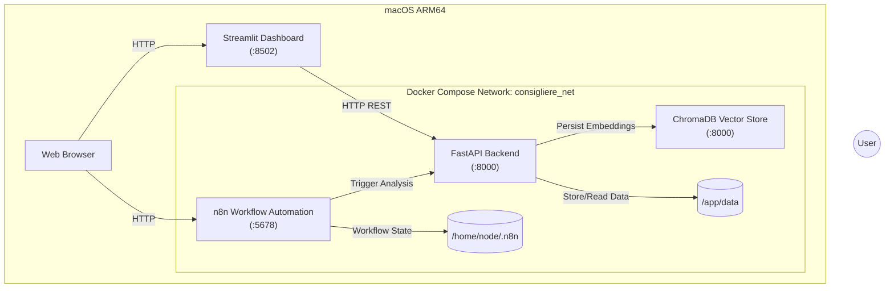

# Infrastructure Snapshot

**Status:** Active
**Last Updated:** 2026-02-18

## 1. Deployment Architecture (Docker Compose)
The Consigliere system is deployed via Docker Compose, ensuring isolation and portability.

### 1.1 Diagram (Mermaid)

## 2. Service Specifications

| Service | Container Name | Host Port | Internal Port | Image Base | Volume Mounts |
| :--- | :--- | :--- | :--- | :--- | :--- |
| **API** | `consigliere_api` | `8000` | `8000` | `python:3.12-slim` | `./src:/app/src` `./data:/app/data` |
| **n8n** | `consigliere_n8n` | `5678` | `5678` | `n8nio/n8n:latest` | `./data/n8n_data:/home/node/.n8n` |
| **ChromaDB** | `consigliere_chromadb` | `8001` | `8000` | `chromadb/chroma` | `./data/chroma_data:/chroma/chroma` |

## 3. Network Configuration
- **Driver:** Bridge
- **Subnet:** Auto-assigned (Docker Internal)
- **Communication:** Services communicate via container names (`http://consigliere_api:8000`, `http://consigliere_chromadb:8000`).

## 4. Local Development Components
- **Streamlit Dashboard:** Currently runs on the host machine (`.venv`).
  - **Command:** `arch -arm64 streamlit run src/dashboard/main.py`
  - **Dependency:** Connects to `localhost:8000` (mapped from Docker).
