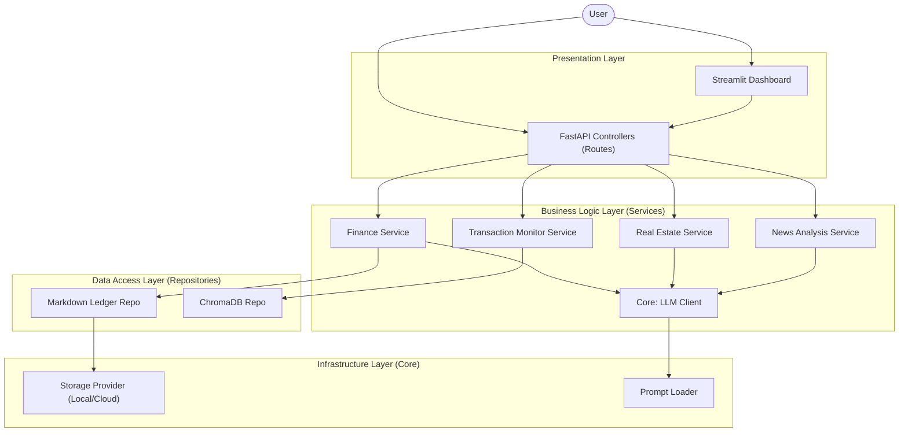

# Software Architecture Snapshot

**Status:** Active
**Last Updated:** 2026-02-18

## 1. Architectural Pattern
The Consigliere codebase follows a **Modular Layered Architecture**. It emphasizes separation of concerns by isolating domain logic into distinct modules, which interact via defined interfaces (Services/Repositories).

### 1.1 Diagram (Mermaid)

## 2. Core Modules (`src/`)

### 2.1 Core (`src/core/`)
- **Purpose:** Provide foundational services used by all modules.
- **Components:**
    - `llm.py`: Wrapper for Gemini AI API.
    - `storage/`: Abstract `StorageProvider` interface for file I/O (Local implementation).
    - `prompt_loader.py`: Loads prompt templates from Markdown files.

### 2.2 Dashboard (`src/dashboard/`)
- **Purpose:** Provide UI for system interaction.
- **Pattern:** Model-View-Controller (MVC) adaptation for Streamlit.
    - `main.py` (Controller/Router): Handles navigation.
    - `views/` (View): Renders specific pages (`finance.py`, `real_estate.py`).
    - `api_client.py` (Model/Service): Encapsulates HTTP calls to the Backend API.

### 2.3 Modules (`src/modules/`)
- **Finance (`src/modules/finance/`):**
    - `service.py`: `FinanceAgent` (Orchestrator).
    - `repository.py`: `LedgerRepository` (Interface).
    - `markdown_ledger.py`: `MarkdownLedgerRepository` (Implementation).
    - `models.py`: Pydantic models for `Transaction`, `LedgerSummary`.

- **Real Estate (`src/modules/real_estate/`):**
    - `service.py`: `RealEstateAgent`.
    - `monitor/`: Sub-module for transaction monitoring (ChromaDB integration).
    - `news/`: Sub-module for news analysis (Naver API + LLM).

## 3. Data Flow
1. **User Action:** User interacts with Dashboard or API.
2. **Controller:** `main.py` or FastAPI route receives the request.
3. **Service:** Specific `Agent` or `Service` processes business logic (e.g., calls LLM).
4. **Repository:** Data is fetched/stored via `Repository` interfaces.
5. **Storage:** Physical I/O happens via `StorageProvider` (Markdown) or Database Client (ChromaDB).
