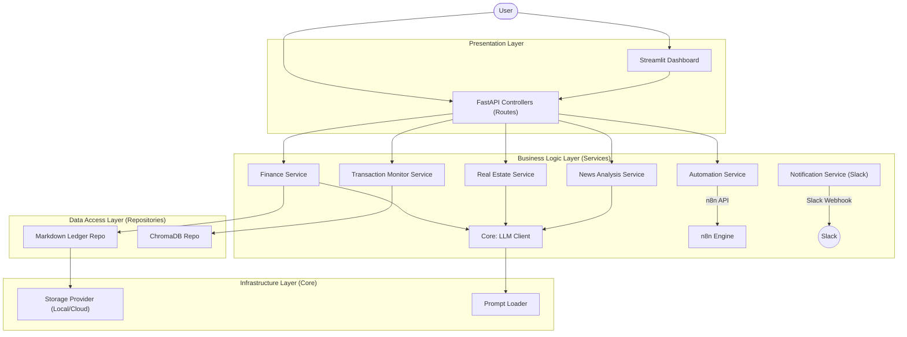

# Software Architecture Snapshot

**Status:** Active
**Last Updated:** 2026-04-18

## 1. Architectural Pattern
The Consigliere codebase follows a **Modular Layered Architecture**. It emphasizes separation of concerns by isolating domain logic into distinct modules, which interact via defined interfaces (Services/Repositories).

### 1.1 Diagram (Mermaid)

```mermaid
graph TD
    User([User])
    
    subgraph Presentation["Presentation Layer"]
        Streamlit["Streamlit Dashboard"]
        FastAPI["FastAPI Controllers (Routes)"]
    end
    
    subgraph Business["Business Logic Layer (Services)"]
        FinanceAgent["Finance Service"]
        RealEstateAgent["Real Estate Service"]
        MonitorService["Transaction Monitor Service"]
        NewsService["News Analysis Service"]
        AutomationService["Automation Service"]
        NotificationService["Notification Service (Slack)"]
        
        FinanceAgent --> LLM["Core: LLM Client"]
        RealEstateAgent --> LLM
        NewsService --> LLM
        AutomationService -- "n8n API" --> N8N["n8n Engine"]
        NotificationService -- "Slack Webhook" --> Slack((Slack))
    end
    
    subgraph DataAccess["Data Access Layer (Repositories)"]
        MarkdownRepo["Markdown Ledger Repo"]
        ChromaRepo["ChromaDB Repo"]
        
        FinanceAgent --> MarkdownRepo
        MonitorService --> ChromaRepo
    end
    
    subgraph Infrastructure["Infrastructure Layer (Core)"]
        Storage["Storage Provider (Local/Cloud)"]
        PromptLoader["Prompt Loader"]
        
        MarkdownRepo --> Storage
        LLM --> PromptLoader
    end
    
    User --> Streamlit
    User --> FastAPI
    Streamlit --> FastAPI
    FastAPI --> FinanceAgent
    FastAPI --> RealEstateAgent
    FastAPI --> MonitorService
    FastAPI --> NewsService
    FastAPI --> AutomationService
```

## 2. Core Modules (`src/`)

### 2.1 Core (`src/core/`)
- **Purpose:** Provide foundational services used by all modules.
- **Components:**
    - `llm.py`: Wrapper for Gemini AI API.
    - `storage/`: Abstract `StorageProvider` interface for file I/O (Local implementation).
    - `prompt_loader.py`: Loads prompt templates from Markdown files.
    - `notify/`: **Slack Integration** (`slack.py`) for sending outgoing alerts.

### 2.2 Dashboard (`src/dashboard/`)
- **Purpose:** Provide UI for system interaction.
- **Pattern:** Model-View-Controller (MVC) adaptation for Streamlit.
    - `main.py` (Controller/Router): Handles navigation.
    - `views/` (View): Renders specific pages (`finance.py`, `real_estate.py`).
    - `api_client.py` (Model/Service): Encapsulates HTTP calls to the Backend API.

### 2.3 Modules (`src/modules/`)
- **Finance (`src/modules/finance/`):**
    - `service.py`: `FinanceAgent` (Orchestrator).
    - `repository.py`: `LedgerRepository` (Interface).
    - `markdown_ledger.py`: `MarkdownLedgerRepository` (Implementation).
    - `models.py`: Pydantic models for `Transaction`, `LedgerSummary`.

- **Real Estate (`src/modules/real_estate/`):**
    - `service.py`: `RealEstateAgent`.
    - `monitor/`: Sub-module for transaction monitoring (ChromaDB integration).
    - `news/`: Sub-module for news analysis (Naver API + LLM).
- **Macro (`src/modules/macro/`):** ← 2026-04-18 추가
    - `models.py`: `MacroIndicatorDef`, `MacroRecord` 데이터클래스
    - `repository.py`: `MacroRepository` — SQLite CRUD (`data/macro.db`)
    - `bok_client.py`: `BOKClient` — BOK ECOS Open API 클라이언트
    - `service.py`: `MacroCollectionService` — 수집 오케스트레이션 (due-check, collect_all)
    - **도메인 중립 공유 패키지** — real_estate/finance 모두 활용 가능

- **Automation (`src/modules/automation/`):**
    - `service.py`: `AutomationService` (n8n API Integration).

- **Career (`src/modules/career/`):** ← 2026-03-28 추가
    - `service.py`: `CareerAgent` (파사드 오케스트레이터)
    - `collectors/`: 9종 Collector — GitHub Trending, HackerNews, DevTo, Wanted, Jumpit, Reddit, Mastodon, Clien, DCInside
      - `base.py`: `BaseCollector` (make_connector 공통 SSL, safe_collect 패턴)
      - `factory.py`: `CollectorFactory` — config 기반 카테고리별 Collector 딕셔너리 생성 (OCP/DIP)
    - `processors/`: 4종 Analyzer — JobAnalyzer, TrendAnalyzer, SkillGapAnalyzer, CommunityAnalyzer
      - `base.py`: `BaseAnalyzer` — `_call_llm(prompt_key, variables, model_class)` 공통 헬퍼 (DRY)
    - `reporters/`: DailyReporter, WeeklyReporter, MonthlyReporter
    - `models.py`: JobPosting, TrendAnalysis, SkillGapAnalysis, CommunityTrendAnalysis 등 12종
    - `config.yaml`: trend_sources, job_sources, community_sources 설정
    - `persona.yaml`: 사용자 스킬/목표 페르소나
    - `history/`: SkillGapSnapshot 이력 추적

## 3. Data Flow
1. **User Action:** User interacts with Dashboard or API.
2. **Controller:** `main.py` or FastAPI route receives the request.
3. **Service:** Specific `Agent` or `Service` processes business logic (e.g., calls LLM).
4. **Repository:** Data is fetched/stored via `Repository` interfaces.
5. **Storage:** Physical I/O happens via `StorageProvider` (Markdown) or Database Client (ChromaDB).
 