# UI Structure Snapshot

**Status:** Active
**Last Updated:** 2026-02-18

## 1. Dashboard Structure (Navigation)
The dashboard follows a simple **Sidebar Navigation** pattern. It uses Streamlit's `st.radio` for menu selection.

### 1.1 Sitemap Diagram (Mermaid)

```mermaid
graph LR
    Root((Consigliere Dashboard))
    
    subgraph Sidebar["Left Sidebar"]
        Nav["Navigation (Radio Button)"]
        Nav -->|Select| Home["🏠 Home"]
        Nav -->|Select| Finance["💰 Finance"]
        Nav -->|Select| RealEstate["🏢 Real Estate"]
    end
    
    subgraph MainContent["Main View"]
        Home --> HomeWidgets["Widgets: Recent Status"]
        Finance --> FinDate["Date Picker"]
        Finance --> FinGrid["Data Editor (Grid)"]
        RealEstate --> RE_Tabs[Tabs]
        
        RE_Tabs --> RE_Tab1["Monitor Tab"]
        RE_Tabs --> RE_Tab2["News Tab"]
    end
```

## 2. Screen Definitions

### 2.1 🏠 Home
- **Purpose:** Provide a quick overview of the agent's status.
- **Components:**
    - `st.subheader("💰 Finance Status")`: Displays summary of recent expenses.
    - `st.subheader("🏢 Real Estate Status")`: Displays recent transaction alerts.

### 2.2 💰 Finance (`src/dashboard/views/finance.py`)
- **Purpose:** Manage and visualize personal finance ledger.
- **Layout:**
    - **Header:** Title "💰 Finance Management"
    - **Control Panel:** Date Picker (`YYYY-MM`)
    - **Metrics:** `st.metric("Total Expense")`
    - **Data Grid (`st.data_editor`):**
        - Columns: `Date` (Date), `Category` (Selectbox), `Item` (Text), `Amount` (Number/KRW)
        - Behavior: Editable, dynamic row addition.
    - **Actions:** "Save Changes" Button (Pending API Implementation).

### 2.3 🏢 Real Estate (`src/dashboard/views/real_estate.py`)
- **Purpose:** Monitor real estate market and analyze news.
- **Layout (Tabs):**
    - **Tab 1: 📊 Market Monitor**
        - Input: `District Code` (Text), `Limit` (Slider)
        - Action: "Fetch Transactions" Button
        - Output: Transactions Table (`st.dataframe`)
    - **Tab 2: 📰 News Insights**
        - Input: `Select Report Date` (Selectbox from API list)
        - Output: Markdown Report Viewer (`st.markdown`)
